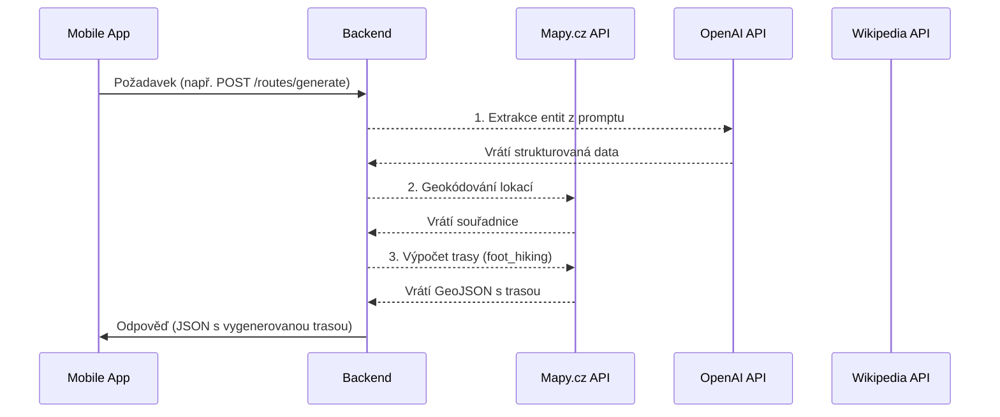

# Architektura Integrace

Tento dokument popisuje, jak spolu komunikují jednotlivé části aplikace HikeAI (`backend` a `mobile`).

---

## Komunikační Model: REST API

Integrace mezi mobilní aplikací a backendem je postavena na standardním **REST API**.

- **Protokol:** HTTP/S
- **Formát dat:** JSON
- **Klient:** Mobilní aplikace používá knihovnu `axios` pro provádění HTTP požadavků.
- **Server:** Backend (Express.js) poskytuje API endpointy.

## Datový tok

Komunikace probíhá výhradně z mobilní aplikace směrem na backend. Backend nikdy nezačíná komunikaci sám.

## Backend for Frontend (BFF)

Pro některé funkce, zejména pro obohacení detailů o místech, funguje backend jako **Backend-for-Frontend (BFF)**. Agreguje data z různých externích služeb a poskytuje je mobilní aplikaci v jednoduchém a jednotném formátu. To snižuje komplexitu na straně klienta.

**Příklad (získání fotky místa):**
1.  Mobilní aplikace pošle `GET /places/photo?name=Lysá+hora` na backend.
2.  Backend postupně zkouší:
    a. Získat obrázek z české Wikipedie.
    b. Pokud neuspěje, hledá na Wikimedia Commons.
    c. Pokud neuspěje, hledá na Unsplash.
3.  Backend vrátí mobilní aplikaci jediný výsledek – URL nalezené fotky.

## Přehled Integračních Bodů

Komunikace je definována v `mobile/src/config/api.js` a implementována v `backend/src/routes/`.

### Trasy (`/routes`)

- `POST /routes/generate`: **Hlavní funkce.** Spustí kompletní proces generování trasy.
- `GET /routes`: Získá seznam již vygenerovaných tras.
- `GET /routes/:id`: Získá detail konkrétní trasy.
- `GET /routes/:id/gpx`: Stáhne GPX soubor pro trasu.

### Místa (`/places`)

- `GET /places/suggest`: Našeptávač pro vyhledávání míst.
- `GET /places/detail`: Získá základní detaily o místě (souřadnice, typ).
- `GET /places/description`: Získá textový popis místa z Wikipedie.
- `GET /places/photo`: Získá URL fotky pro dané místo.

### Ostatní

- `GET /health`: Endpoint pro kontrolu stavu backendu a jeho služeb.
