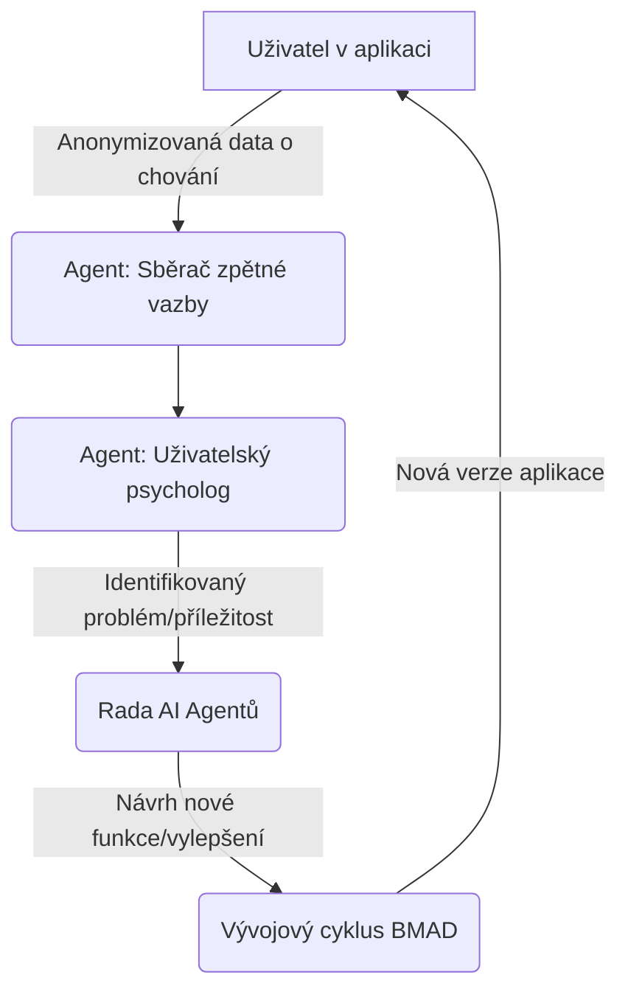

# Strategická vize a efektivní využití BMAD

**Datum:** 1. listopadu 2025

_Tento dokument shrnuje strategickou vizi pro evoluci projektu HikeAI a definuje efektivní model pro využívání multi-agentního systému BMAD._

---

## 1. Jak efektivně používat BMAD: Meta-Workflow

Problém manuálního volání jednotlivých agentů je řešen zavedením zastřešujícího **"Meta-Workflow"** s názvem **"Životní cyklus nové funkce"**. Tento přístup zjednodušuje interakci s celým systémem na dva hlavní příkazy.

### Fáze 1: Strategický návrh (manuální spuštění)

Kreativní fáze, která se spouští jediným příkazem pro svolání Rady AI Agentů.

**Příkaz:**
`> rada:navrhni "Vysokoúrovňový popis nové funkce"`

**Výstup:** Ucelený **Specifikační dokument**, který slouží jako zadání pro implementaci.

### Fáze 2: Automatizovaná implementace

Plně automatizovaná kaskáda, která na základě schválené specifikace provede vývoj, testování a nasazení.

**Příkaz:**
`> implementuj:funkci "cesta/ke/specifikaci.md"`

**Výstup:** Hotová, otestovaná a zdokumentovaná funkce v aplikaci.

--- 

## 2. Vize dokonalého systému: BMAD-S

Cílem je evoluce současného BMAD na **BMAD-S (Symbiotic)** – systém, který vytváří živou, symbiotickou smyčku mezi aplikací a jejími uživateli.

### Pilíře systému BMAD-S:

1.  **Symbiotická smyčka:** Systém proaktivně naslouchá uživatelům, analyzuje jejich chování a automaticky generuje podněty k vylepšení pro Radu AI Agentů.
2.  **Proaktivní vývoj a sebe-opravný kód:** Vývoj není pouze reaktivní na zadání, ale je řízen reálnými daty z produkce. Systém sám identifikuje a navrhuje opravy pro chyby nebo pokles výkonu.
3.  **Uživatel jako člen týmu:** Systém uzavírá smyčku tím, že může automaticky informovat uživatele o tom, že jejich zpětná vazba vedla k reálnému vylepšení aplikace.

---

## 3. Nové role AI agentů v systému BMAD-S

Pro realizaci vize BMAD-S je potřeba rozšířit stávající tým agentů o následující nové, specializované role:

| Agent | Popis role |
|---|---|
| **Sběrač zpětné vazby** | **Žije v produkci.** Anonymně monitoruje chování uživatelů, analyzuje populární funkce, body odchodu a sbírá explicitní zpětnou vazbu. |
| **Uživatelský psycholog** | Analyzuje data od "Sběrače" a snaží se pochopit *proč* se uživatelé chovají daným způsobem. Vytváří dynamické persony a formuluje "Problémové briefy". |
| **Analytik selhání (QA)** | Aktivuje se při selhání automatických testů. Analyzuje chybu, kód a snaží se identifikovat kořenovou příčinu problému, čímž zrychluje opravu. |
| **Strážce výkonnosti** | Monitoruje výkonnostní metriky aplikace v produkci. Pokud detekuje zpomalení, automaticky vytvoří technický úkol pro optimalizaci. |
| **Komunitní manažer** | Komunikuje s uživateli. Může je například automaticky informovat, že jejich návrh na vylepšení byl úspěšně implementován. |